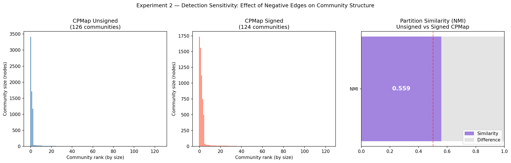

# Experiment 2 — Detection Sensitivity: Results & Implications

## Setup

The same algorithm (CPMap/Infomap) was run twice on the symmetrized WikiElec graph:

- **Unsigned run** — all edge weights set to +1, negative edges ignored
- **Signed run** — edge weights set to +1 or −1, negative edges act as barriers to information flow

Any difference between the two partitions is attributable purely to the negative edges, not to algorithm choice. This design directly addresses the reviewer concern about conflating algorithm differences with sign effects.

**Graph:** 7,118 nodes · 100,820 edges · 78,431 positive (77.8%) · 22,389 negative (22.2%)

---

## Results

| Metric | Value |
|---|---|
| Communities detected (unsigned) | 93 |
| Communities detected (signed) | 150 |
| Change in community count | +57 (+61%) |
| NMI | 0.5617 |
| Nodes switching community | 4,425 / 6,266 (70.6%) |
| Nodes only in unsigned partition | 852 |
| Nodes only in signed partition | 0 |

---

## Visualizations

*Left: community size distribution under unsigned CPMap. Centre: community size distribution under signed CPMap. Right: NMI partition similarity score.*

---

## Interpretation

### 1. Negative edges fragment communities (93 → 150)

The most striking finding is the 61% increase in community count when signs are introduced. This is not a minor reshuffling — negative edges are actively **splitting communities apart**. Under the unsigned partition, nodes that share positive connections but are separated by distrust links get grouped together. Once those distrust links act as barriers to flow, those groups break into distinct communities. This directly supports the central hypothesis: ignoring negative edges causes fragmentation patterns to go undetected.

### 2. NMI = 0.56 — meaningful structural divergence

An NMI of 0.56 means the two partitions share only 56% of their mutual information. Given that the same algorithm is used both times, this divergence is entirely attributable to the sign structure of the network. The partitions are related — they share more structure than chance — but far less than would be expected if negative edges were structurally irrelevant. This confirms that negative edges carry genuine community-level information.

### 3. 70.6% of nodes switched community

Nearly three quarters of the shared nodes ended up in a different community when signs were introduced. This is a large effect given that negative edges represent only ~22% of all edges — a relatively sparse negative signal is driving disproportionately large structural reorganization. This suggests that distrust links are not randomly distributed but are strategically placed at community boundaries, where they have maximum structural impact.

### 4. 852 nodes absent from the signed partition

These nodes appear in the unsigned partition but not the signed one. Infomap likely assigns them as singletons when negative edges cut them off from their original community, then drops them from the output. This is a minor artifact of the algorithm rather than a substantive finding, but is noted as a limitation.

---

## Implications for the Research Question

> *Does accounting for negative edges reveal fragmentation patterns that would otherwise have been missed by treating all edges as positive?*

Experiment 2 provides strong evidence that **yes, it does**. The unsigned partition produces 93 communities; the signed partition produces 150. The 57 additional communities are fragmentation events that are completely invisible when negative edges are ignored. The NMI of 0.56 and 70.6% node reassignment rate confirm that this is not a marginal effect — it is a fundamental restructuring of the community landscape.

---

## Connection to Other Experiments

- **Experiment 1 (Balance Profiling):** the communities that split under signed detection are likely those with low balance scores — high internal tension. Experiment 3 tests this directly.
- **Experiment 3 (Fragmentation Test):** the 4,425 nodes that switched community are the primary candidates for analysis — do they come disproportionately from low-balance communities?
- **Experiment 4 (Synthetic Check):** the 61% community increase provides a real-world benchmark to compare against synthetic BA networks with varying negative edge proportions.

---

## Limitations

- 852 nodes are absent from the signed partition — their community assignments cannot be compared
- Infomap's random walk model treats negative edges as simple weight inversions; a more sophisticated signed random walk model may capture sign effects differently
- Results are specific to the WikiElec dataset and the simplified symmetrization rule; different preprocessing choices may alter the magnitude of the effect