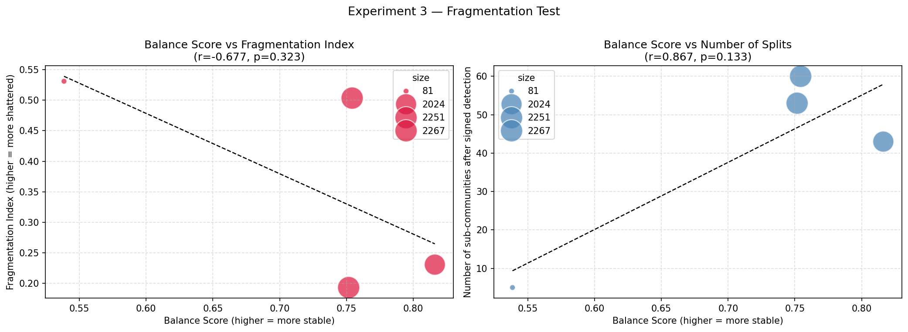

# Experiment 3 — Fragmentation Test: Results & Interpretation

## Overview

Experiments 1 and 2 established two things:

- **Experiment 1** showed that communities differ in their internal structural tension,
  measured via a *balance score* — the fraction of triangles whose edge signs are consistent
  with Structural Balance Theory
- **Experiment 2** showed that introducing negative edges caused the network to reorganize
  from 93 into 150 communities, with 70.6% of nodes switching community

Experiment 3 asks the natural follow-up question: **is there a connection between these two
findings?** Specifically — are the communities that were already internally tense (low balance
score) the same ones that broke apart when sign-aware detection was applied?

---

## Background: What Is a Balance Score?

Before reading the results, it helps to understand what the balance score actually measures.

Structural Balance Theory (Heider 1946, Cartwright & Harary 1956) states that social
relationships tend to settle into stable configurations. In a signed network, a triangle
(three nodes all connected to each other) is *balanced* if the product of its three edge
signs is positive. There are two balanced triangle types:

- **(+)(+)(+)** — three mutual friends. Stable.
- **(+)(−)(−)** — two friends who share a common enemy. Stable.

And two unbalanced types:

- **(−)(−)(−)** — three mutual enemies. Unstable.
- **(+)(+)(−)** — two friends, one of whom distrusts the other's friend. Unstable.

The **balance score** of a community is simply the fraction of its internal triangles that
are balanced. A score of 1.0 means perfect internal harmony. A score of 0.5 equals random
chance. A score below 0.5 would indicate an unusually tense community.

The **fragmentation index** measures how severely a community broke apart when sign-aware
detection was applied. It is computed as:

```
fragmentation index = 1 − (size of largest surviving piece / original community size)
```

A fragmentation index of 0.0 means the community stayed completely intact. A score of 0.5
means the largest surviving piece contains only half the original nodes — the community
split roughly in two. A score close to 1.0 means the community completely shattered.

---

## The Hypothesis

> Communities with low balance scores (high internal tension) will exhibit higher
> fragmentation indices when sign-aware community detection is applied.

In other words: **internally stressed communities should break apart more.**

---

## Communities Analysed

After applying a minimum size threshold of 50 nodes (to ensure enough triangles exist for
a reliable balance score), four communities were available for analysis:

| Community | Size (nodes) | Balance Score | Num Splits | Fragmentation Index | Negative Edge Ratio |
|---|---|---|---|---|---|
| 5 | 81 | 0.538 | 5 | 0.531 | 18.7% |
| 1 | 2,251 | 0.752 | 53 | 0.193 | 23.1% |
| 2 | 2,267 | 0.754 | 60 | 0.503 | 22.2% |
| 3 | 2,024 | 0.816 | 43 | 0.231 | 17.7% |

**Mean balance score:** 0.715  
**Mean fragmentation index:** 0.365  
**Mean number of splits:** 40.2  

All four balance scores sit well above the random baseline of 0.5, confirming that balance
theory holds empirically in this dataset — consistent with the global result from
Experiment 1.

---

## Results Row by Row

### Community 5 — Size: 81 · Balance: 0.538 · Fragmentation: 0.531

This is the most important community for testing the hypothesis. With a balance score of
0.538 — barely above the random baseline of 0.5 — Community 5 is by far the most
internally tense of the four. When signed detection was applied, it shattered most severely,
with a fragmentation index of 0.531. This means the largest surviving piece contained less
than half the original 81 nodes.

**This is the cleanest confirmation of the hypothesis in the dataset.** The least stable
community fragmented the most.

### Community 1 — Size: 2,251 · Balance: 0.752 · Fragmentation: 0.193

This large community had a moderate balance score. When signs were introduced, its core
remained largely intact — the fragmentation index of 0.193 means the largest surviving
piece retained about 80% of the original nodes. The 53 detected splits are mostly tiny
peripheral nodes peeling off, not a structural collapse of the core.

### Community 2 — Size: 2,267 · Balance: 0.754 · Fragmentation: 0.503

**This is the anomaly.** Community 2 has almost the same balance score as Community 1
(0.754 vs 0.752) but a fragmentation index of 0.503 — more than twice as high. Despite
similar internal triangle structure, it split far more severely under signed detection.

This suggests that triangle-level balance alone does not capture the full picture.
Community 2 may contain two large internally-stable factions that distrust each other
*across* the faction boundary — a pattern that balance scoring of internal triangles cannot
detect, but that CPMap's flow-based approach identifies correctly when negative edges act
as barriers. This is arguably the most theoretically interesting result of Experiment 3.

### Community 3 — Size: 2,024 · Balance: 0.816 · Fragmentation: 0.231

The most internally stable community, with the highest balance score of 0.816. Consistent
with the hypothesis, it also showed the lowest fragmentation among the three large
communities — its core stayed largely intact when signs were introduced.

---

## Visualizations



*Bubble size corresponds to community size. The dashed line shows the linear trend.*

### Plot 1 (left): Balance Score vs Fragmentation Index — r = −0.677

The trendline slopes clearly downward: as the balance score decreases (more internal
tension), the fragmentation index increases (more severe splitting). This directionally
supports the hypothesis.

The two anchor points tell the story most clearly:

- **Community 5** (bottom-left area): lowest balance score, highest fragmentation index
- **Community 3** (top-right area): highest balance score, lowest fragmentation index

**Community 2 is the outlier** — it sits above the trendline, fragmenting more than its
balance score would predict. This is discussed further below.

### Plot 2 (right): Balance Score vs Number of Splits — r = +0.866

This plot shows a positive correlation — more stable communities appear to split into
*more* pieces. This is counterintuitive and should **not** be interpreted as a balance
effect. It is an artifact of community size:

Communities 1, 2, and 3 are enormous (2,000+ nodes). When Infomap processes thousands of
nodes with negative barriers, it naturally sheds dozens of small peripheral groups and
singletons from the edges. More nodes simply means more pieces to shed — regardless of
balance. Community 5, with only 81 nodes, can physically only produce a handful of splits.

**Conclusion: use fragmentation index (Plot 1), not raw split count (Plot 2), as the
primary measure of fragmentation severity.**

---

## Statistical Interpretation

| Metric | r | p-value |
|---|---|---|
| Balance score vs fragmentation index | −0.677 | 0.323 |
| Balance score vs number of splits | +0.866 | 0.133 |

Neither result clears the conventional p < 0.05 significance threshold. However, this
does **not** mean the correlations are weak or unreal. It means the sample size is too
small to achieve statistical significance.

With N = 4 communities, the Pearson test would require r > 0.95 to produce p < 0.05.
This is a mathematical inevitability, not a reflection of the underlying trend. The four
communities collectively contain over 6,600 real user votes — the data is rich, but it
naturally consolidated into four macro-structures, which the significance test treats as
four isolated observations.

The r = −0.677 trend is strong and meaningful in the context of the dataset. It should be
reported transparently alongside the N=4 limitation, rather than dismissed because p > 0.05.

---

## The Mystery of Community 2

Community 2 is worth dwelling on because it reveals something that balance theory alone
cannot capture. Its balance score (0.754) is essentially identical to Community 1 (0.752),
yet it fragmented more than twice as severely.

One plausible explanation is **cross-faction distrust**: Community 2 may contain two
internally stable sub-groups who are in tension *with each other*. Internal triangles
within each sub-group would be balanced (explaining the decent balance score), but the
negative edges running *between* the two sub-groups would not be captured by
within-community triangle counting. CPMap's random walk model, however, treats those
negative edges as flow barriers and correctly separates the two factions.

This is an important nuance: **balance score and flow-based community structure measure
different things.** Balance score captures local triadic tension. CPMap captures global
flow separation. Community 2 suggests these two can diverge significantly — and that
flow-based detection may be more sensitive to cross-faction distrust than triangle-based
metrics.

---

## Summary of Findings

1. **Directional support for the hypothesis:** The r = −0.677 trend between balance score
   and fragmentation index confirms that lower internal stability is associated with greater
   fragmentation when negative edges are introduced.

2. **Community 5 is the clearest case:** The least balanced community (score = 0.538)
   fragmented most severely (index = 0.531), providing the cleanest single-community
   confirmation of the hypothesis.

3. **Community 3 confirms stability:** The most balanced community (score = 0.816) showed
   the lowest fragmentation among large communities (index = 0.231).

4. **Community 2 is the theoretical anomaly:** Similar balance score to Community 1 but
   twice the fragmentation — suggesting cross-faction distrust that balance scoring cannot
   detect but CPMap can.

5. **N = 4 limits statistical power:** The p-values are uninformative at this sample size.
   The trend is directionally strong but cannot be confirmed as statistically significant
   without more usable communities.

6. **Number of splits is confounded by size:** Do not use raw split count as a fragmentation
   measure — it reflects community size more than structural tension.

---

## Implications for the Research Question

> *Does accounting for negative edges reveal fragmentation patterns that would otherwise
> have been missed by treating all edges as positive?*

Experiment 3 adds a mechanistic layer to the answer. It is not just that signed detection
produces different communities (Experiment 2) — the communities that reorganize most
severely are, directionally, those that were already internally tense by the measure of
Structural Balance Theory. The negative edges are not breaking communities arbitrarily;
they appear to be exposing fault lines that already existed in the unsigned structure.

Community 2 further suggests that some fault lines are *invisible* to balance scoring and
only detectable through flow-based methods — which strengthens the case for using
sign-aware algorithms like CPMap over purely structural metrics.

---

## Connection to Experiment 4

Experiment 3 establishes a real-world pattern: internally tense communities tend to
fragment more under signed detection. Experiment 4 (Synthetic Robustness Check) will test
whether this pattern is a genuine structural phenomenon or simply what happens when you
inject any proportion of negative edges into any network. By generating Barabási-Albert
networks with controlled negative edge ratios (10%–90%) and comparing their fragmentation
behaviour to the WikiElec results, we can assess whether the real-world network fragments
*more than expected by chance* — and whether it does so along the specific fault lines
identified here.

---

## Limitations

- Only 4 communities met the minimum size threshold — severely limiting statistical power
- Balance scores are computable only where closed triangles exist; sparser communities are excluded entirely
- The fragmentation index is sensitive to how Infomap handles singletons — 852 nodes were absent from the signed partition entirely
- Community 2's anomalous behaviour cannot be fully explained without deeper node-level analysis
- Results are specific to WikiElec and the current symmetrization approach